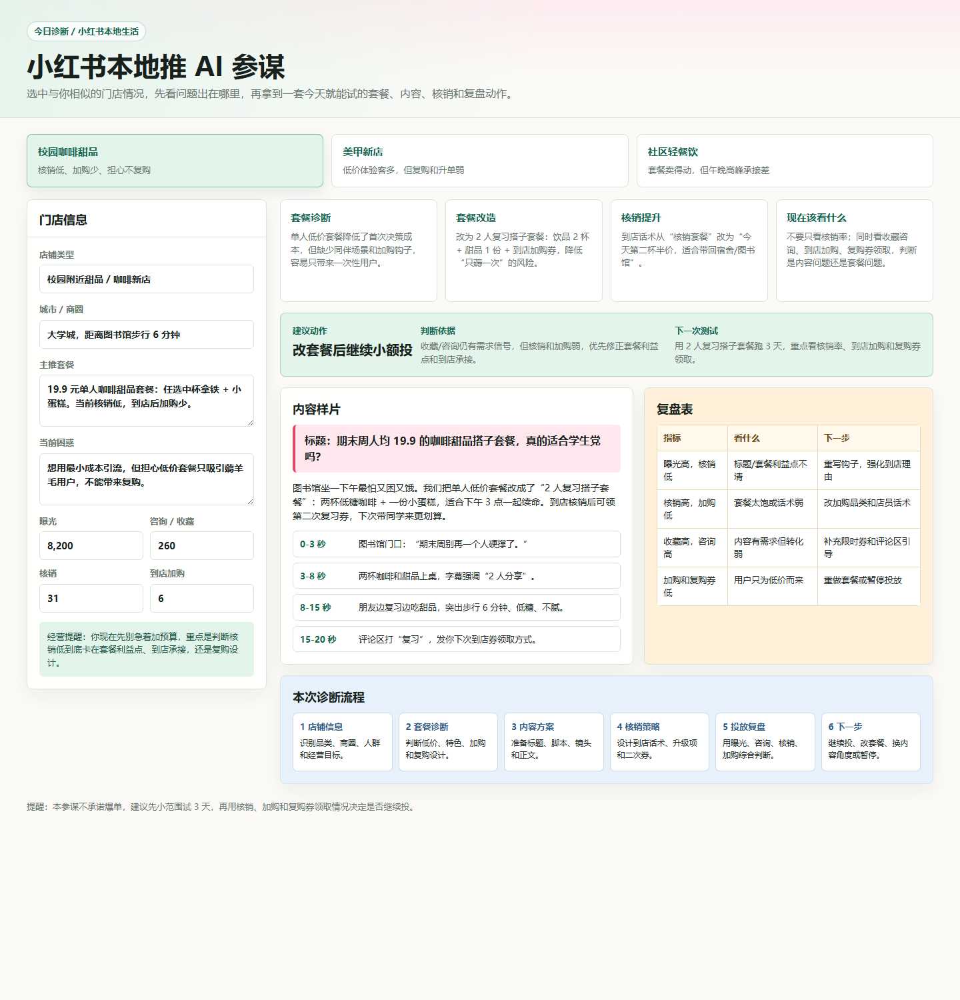

# 小红书本地生活 AI 引流参谋

面向小红书本地生活小商家的轻量机会验证 MVP。它不做“一键爆款文案”，而是帮助新店和小店把“套餐怎么设、内容怎么发、核销低怎么办、投放值不值”变成一套可执行、可核销、可复盘的流程。

## 30 秒看懂

- **一句话**：给本地小店一套从套餐诊断、内容样片到 ROI 复盘的 AI 工作流。
- **目标用户**：咖啡、甜品、美甲、轻餐饮等正在尝试小红书团购、本地推、探店和种草的小商家。
- **核心洞察**：商家缺的不是单篇文案，而是把套餐、内容、核销、加购、复购和投放串起来的判断流程。

## 项目材料

- [在线 Demo](https://jiojioyize.github.io/xhs-local-life-ai-advisor/)
- [Prompt 流程](./prompt-workflow.md)
- [样例输出](./sample-output.md)
- [用户证据整理](./research-notes.md)
- [两周验证计划](./validation-plan.md)

## MVP Demo

Demo 是一个轻交互静态原型，不连接真实 AI API。点击顶部案例可以切换 3 类本地生活商家：

1. 校园咖啡甜品：核销低、加购少、担心不复购。
2. 美甲新店：低价体验客多，但复购和升单弱。
3. 社区轻餐饮：套餐卖得动，但午晚高峰承接差。

每个案例都输出四块内容：

- **套餐诊断**：判断低价套餐、特色、加购和复购设计。
- **内容样片**：给出标题、正文、短视频分镜和评论区引导。
- **核销提升**：设计到店话术、加购品和二次券。
- **复盘表**：用曝光、咨询、核销、加购等指标判断下一步动作。

## 为什么不是普通文案工具

普通 AI 文案工具通常从“写什么”开始，但本项目从“为什么投放效果不好”开始。对本地生活小商家来说，曝光、核销、加购和复购是连在一起的：如果套餐本身不能承接到店，文案再多也只是制造短期流量。

因此这个 MVP 把 AI 放在三个环节：

1. 先诊断套餐和经营目标。
2. 再生成服务核销和复购的内容。
3. 最后用复盘表判断继续投、改套餐、改内容或暂停。

## 用户证据

基于小红书商家求助内容的截图观察，痛点集中在以下几类：

- “本地推 ROI 很高，但是核销率很低怎么办”
- “新店，怎么用最小成本引流”
- “团购直播可行吗……感觉核销率很低”
- 很多商家看到短期不赚钱就下架，但低价引流套餐本来应服务于到店、加购和复购。

详见 [`research-notes.md`](./research-notes.md)。

## 商业判断

不先给一个拍脑袋价格，而是用 MVP 验证付费逻辑：

- 先验证商家是否愿意为“单次诊断”付费：套餐诊断 + 内容方案 + 复盘建议。
- 再验证是否存在持续需求：每周选题、套餐调整、投放复盘。
- 定价锚点来自替代成本：自己摸索、请人写笔记、找达人探店、投本地推、买代运营。

## 两周验证计划

| 时间 | 任务 | 验证目标 |
| --- | --- | --- |
| Day 1-2 | 收集 30 条小红书本地生活商家求助内容 | 验证痛点频次 |
| Day 3-4 | 访谈 5 家本地小店 | 验证真实经营场景 |
| Day 5-6 | 用 Demo 生成 3 套商家方案 | 验证 MVP 表达 |
| Day 7-10 | 让 3 家商家评估或试用方案 | 验证采纳率 |
| Day 11-14 | 测试继续使用或付费意愿 | 验证商业信号 |

详见 [`validation-plan.md`](./validation-plan.md)。

## 项目边界

- 不做完整投流平台。
- 不承诺“爆单”。
- 不虚构真实访谈数据。
- 当前版本是轻量机会验证，用于说明需求、MVP 和验证路径。
