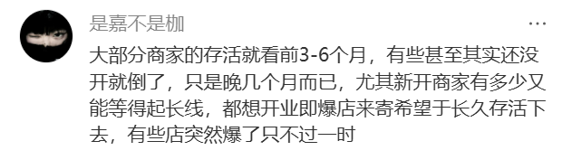
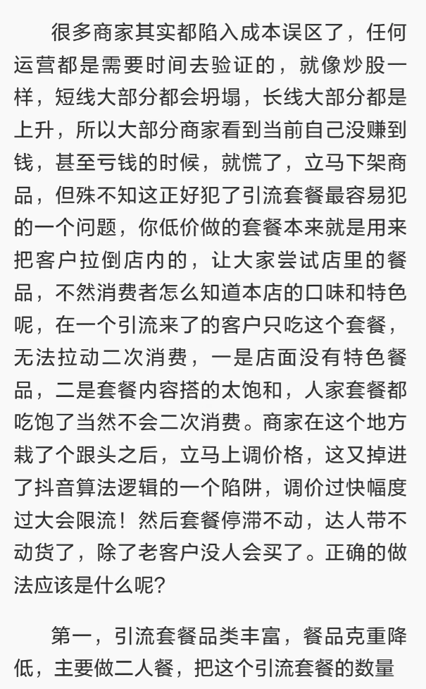
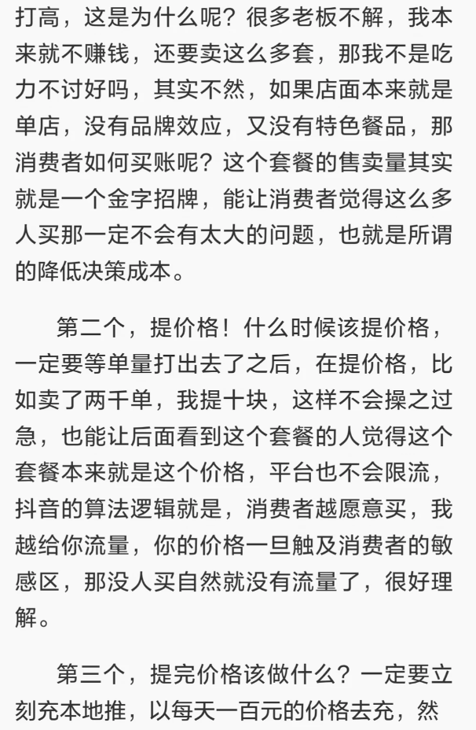
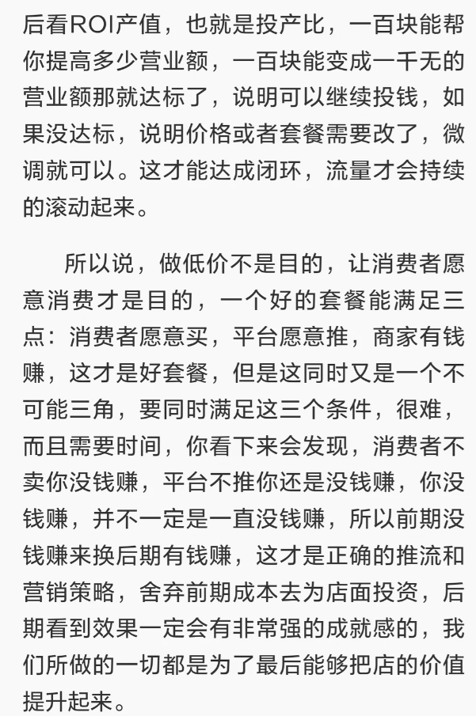

# 用户证据与痛点分类

本文件整理已收集的小红书截图证据，用于支撑“本地生活商家需要 AI 引流诊断与内容复盘助手”的机会判断。当前证据来自公开内容观察和截图摘录，不等同于一手深访结论。

## 证据可信度说明

这些截图的作用是帮助识别高频问题和设计 MVP 假设。它们能证明“公开讨论中确实存在这类商家困惑”，但不能直接证明付费意愿。后续仍需要通过 5 家商家访谈、3 家方案试用和付费信号测试继续验证。

## 原始截图证据

| 编号 | 截图 | 对应痛点 |
| --- | --- | --- |
| E01 |  | ROI 不会看、核销低 |
| E02 |  | 投流焦虑、短期效果误判 |
| E03-E05 |    | 套餐设计、加购复购、ROI 闭环 |
| E06 |  | 新店低成本引流 |
| E07 |  | 团购直播不确定、核销低 |

## 痛点分类表

| 痛点分类 | 观察到的表达 | 初步解释 | 对产品的启发 |
| --- | --- | --- | --- |
| ROI 不会看 | “本地推 ROI 很高，但是核销率很低怎么办” | 商家已经投放，但不知道如何理解曝光、ROI、核销之间的关系 | 产品不能只生成文案，要给复盘判断 |
| 低成本引流 | “新店，怎么用最小成本引流” | 新店预算有限，希望先用小成本验证到店 | MVP 应提供低成本套餐和内容组合 |
| 核销低 | “团购直播可行吗……感觉核销率很低” | 商家对团购、直播、本地推效果不确定 | 需要解释核销低是内容问题、套餐问题还是履约问题 |
| 套餐不会设 | 笔记提到商家容易陷入成本误区，看到短期不赚钱就下架商品 | 低价套餐本应服务到店、加购和复购，但商家常只看短期盈亏 | 产品要做套餐诊断和加购/复购设计 |
| 投流焦虑 | “有些店突然爆了只不过一时，后面带不动货” | 商家担心短期流量不可持续 | 复盘表需要给出继续投、改套餐、暂停投放的判断 |

## 痛点结论

这些证据共同指向一个更深的问题：本地小商家并不只是缺内容创意，而是缺一套把 **套餐、内容、核销、加购、复购、投放** 串起来的判断流程。

因此 MVP 的核心假设是：

> 如果 AI 能把商家的模糊经营问题转化为“套餐诊断 + 内容样片 + 核销策略 + 下一步决策”，商家会比单纯文案工具更愿意采纳或付费。

## 下一步证据补强

后续两周验证中，需要补充三类一手证据：

1. **访谈证据**：5 家本地小店如何做小红书、投放和团购。
2. **采纳证据**：3 家商家是否愿意使用 AI 方案并执行。
3. **付费信号**：商家认为方案替代了哪类成本，是否愿意按次或持续使用。

## 不做的结论

- 不宣称已经验证付费转化。
- 不宣称 AI 能保证爆单。
- 不把公开截图观察包装成真实访谈数据。
